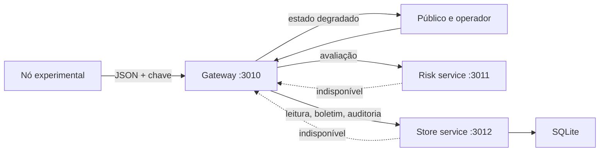

# Horizonte — PI VI

[](https://github.com/pedrobragabes/univesp-pi6-horizonte/actions/workflows/ci.yml)
[](https://github.com/pedrobragabes/univesp-pi6-horizonte/actions/workflows/codeql.yml)
[](LICENSE)

Plataforma distribuída e acessível de apoio à preparação comunitária para episódios de calor. O sistema integra telemetria experimental, avaliação explicável, registro auditável e comunicação operacional sem apresentar o protótipo como infraestrutura oficial ou dispositivo de saúde.

O projeto é uma fundação para o **Projeto Integrador em Computação VI (PJI610)** ou **Projeto Integrador Extensionista VI**, conforme a matrícula. Ele cobre o núcleo comum dos PPCs de 2025 e 2026: hardware/software, serviços distribuídos, interface e UX, acessibilidade, testes e CI, viabilidade, modelagem de negócios, ética e impacto tecnológico.

> Todos os nomes de zona e dados de demonstração são fictícios. Não existe parceiro, piloto público ou validação com usuários nesta etapa. Essas evidências deverão ser produzidas no semestre e jamais simuladas.

## Estado

| Dimensão | Situação |
|---|---|
| fundação técnica | concluída, com 7 testes distribuídos e release `v0.1.0-foundation` |
| entrega acadêmica | pendente de parceiro, usuários, carga, cotações, relatório e vídeo |
| dados | zonas e leituras exclusivamente demonstrativas |
| implantação | arquitetura reproduzível local; produção não preparada |

## Produto

- painel público com situação normal, atenção, alerta ou indisponível por zona;
- expiração de leituras após cinco minutos para evitar falsa atualidade;
- área operacional protegida por senha, sessão, CSRF e papéis;
- registro manual sempre identificado como simulado ou experimental;
- boletins operacionais separados da recomendação algorítmica;
- API de dispositivo compatível com um recorte do contrato do Sentinela;
- avaliação por índice de calor em serviço independente e versionado;
- serviço de registro com SQLite, idempotência e auditoria mínima;
- saúde agregada das dependências e degradação explícita;
- testes entre processos HTTP reais e CI.

## Arquitetura



Os serviços têm contratos e processos separados. Para um piloto pequeno eles podem compartilhar a mesma máquina; o isolamento permite substituir persistência, escalar avaliação ou distribuir componentes sem reescrever a interface.

## Executar no Windows

Requer Python 3.14. Prepare o ambiente:

```powershell
python -m venv .venv
.\.venv\Scripts\python.exe -m pip install -r requirements.txt
$env:HORIZONTE_SERVICE_KEY = "chave-interna-forte"
$env:HORIZONTE_DEVICE_KEY = "chave-do-dispositivo-forte"
$env:HORIZONTE_SESSION_SECRET = "segredo-de-sessao-aleatorio"
$env:HORIZONTE_OPERATOR_PASSWORD = "senha-operacional-forte"
```

Abra três terminais no repositório, repita as variáveis de ambiente e execute:

```powershell
.\.venv\Scripts\python.exe -m services.store.app
.\.venv\Scripts\python.exe -m services.risk.app
.\.venv\Scripts\python.exe -m gateway.app
```

O painel fica em `http://127.0.0.1:3010`. Para gerar três zonas de demonstração:

```powershell
.\.venv\Scripts\python.exe scripts\send_demo.py
```

## Testes

```powershell
.\.venv\Scripts\python.exe -m unittest discover -s tests -v
.\.venv\Scripts\python.exe -m pip check
.\.venv\Scripts\python.exe -m compileall -q common gateway services tests
```

Os 7 testes cobrem motor de risco, comunicação entre serviços, autenticação, CSRF, telemetria idempotente, auditoria, validação interna, expiração de dados, saúde e degradação quando o armazenamento falha.

Execute a suíte a partir da raiz do repositório; os imports `common`, `gateway` e `services` dependem desse diretório de trabalho.

## Estrutura

```text
common/       cliente HTTP e erros compartilhados
gateway/      interface pública, operação e API de dispositivos
services/     motor de risco e serviço de registro
scripts/      carga de demonstração identificada
templates/    jornadas pública e operacional
static/       identidade visual responsiva
tests/        testes unitários e distribuídos
docs/         arquitetura, operação, validação, viabilidade, ética e revisão
```

## Documentação

- [Arquitetura e decisões](docs/01-arquitetura.md)
- [Operação e continuidade](docs/02-operacao.md)
- [Validação técnica](docs/03-validacao.md)
- [Viabilidade e modelo de negócio](docs/04-viabilidade.md)
- [Ética e impacto](docs/05-etica-e-impacto.md)
- [Revisão de código](docs/06-revisao-de-codigo.md)
- [Modelo de relatório parcial](docs/07-relatorio-parcial.md)
- [Modelo de relatório final](docs/08-relatorio-final.md)

## Limites para implantação

Os servidores Flask incluídos são de desenvolvimento. Um ambiente externo exige HTTPS, proxy/reverse proxy, servidor WSGI, segredos exclusivos e rotacionáveis, limitação de tentativas, banco com backup, logs centralizados, responsáveis de plantão e canais oficiais definidos. A regra de índice de calor é informativa e não substitui autoridades meteorológicas, defesa civil ou profissionais de saúde.

## Próximos passos acadêmicos

1. confirmar PJI VI ou PIE VI no AVA;
2. validar o problema com parceiro e público reais;
3. redesenhar zonas, linguagem e jornadas com usuários;
4. integrar somente fontes autorizadas e calibradas;
5. executar acessibilidade, carga, segurança e piloto de campo;
6. coletar cotações e validar o modelo operacional;
7. registrar devolutiva e recomendação explícita de adotar, pilotar ou não adotar;
8. produzir relatório final e vídeo conforme as regras vigentes.

## Governança e licença

As atividades devem ser acompanhadas por issues e milestones alinhados ao AVA. Consulte [SECURITY.md](SECURITY.md). O código usa [licença MIT](LICENSE); dados, comunicações e evidências de parceiros mantêm regras próprias.
